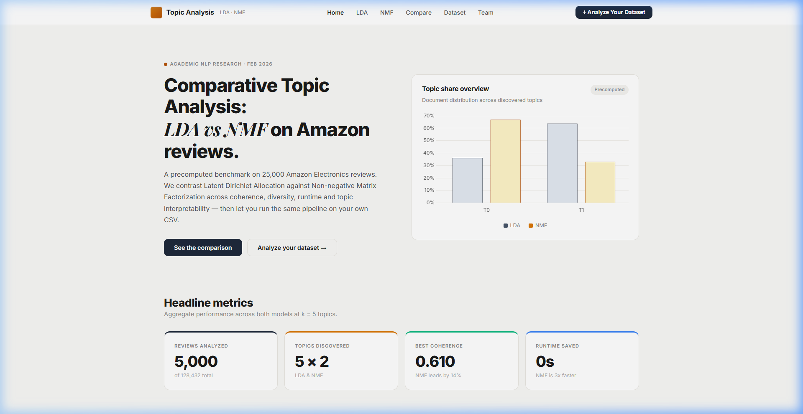
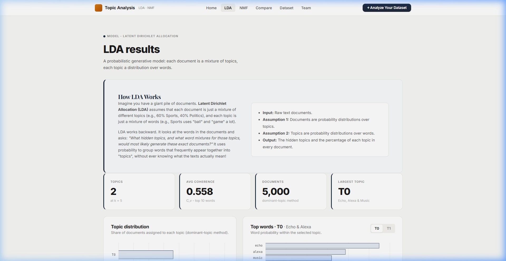
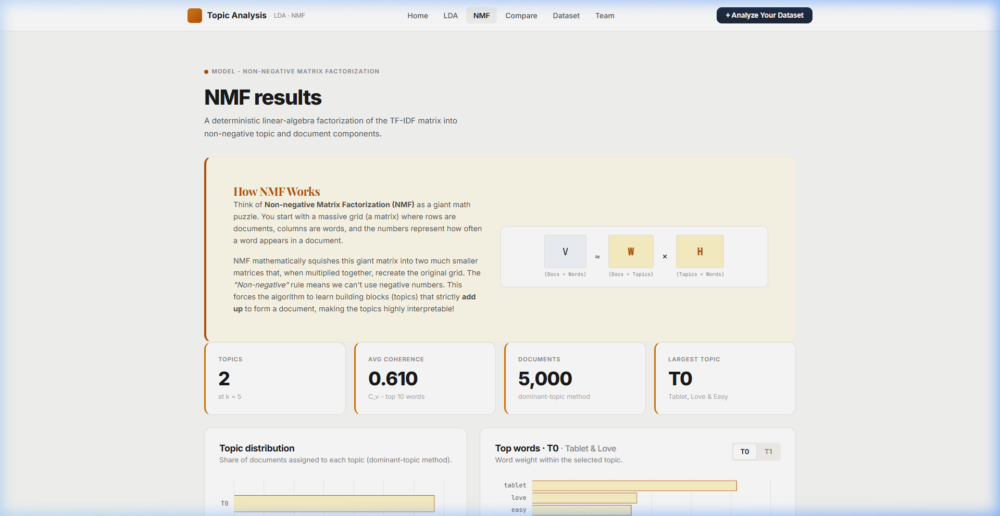
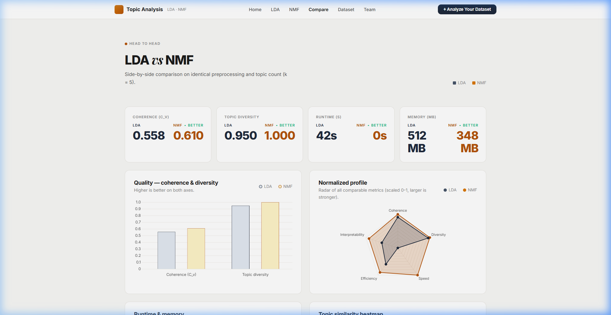
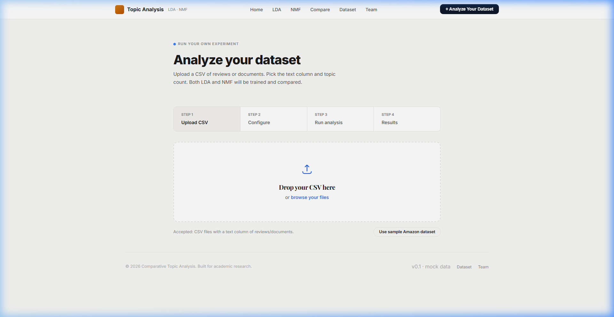

# Topic Modeling Dashboard

A Flask-based topic modeling dashboard that evaluates and compares Latent Dirichlet Allocation (LDA) vs Non-Negative Matrix Factorization (NMF) on Amazon product reviews.

## Demo Video
See the dashboard in action below! It demonstrates the topic analysis overview, comparing models, and testing custom datasets.


## Screenshots

### 1. Main Dashboard Overview
Provides a high-level view of topics extracted, model runtimes, and a comparative overview.


### 2. LDA Model Insights
Dive deep into topics extracted specifically by the LDA model, including top words and documents.


### 3. NMF Model Insights
Explore the alternative perspectives and word distributions generated by the NMF model.


### 4. Head-to-Head Evaluation
Detailed metrics and matrix breakdowns comparing LDA against NMF on coherence and diversity.


### 5. Custom Dataset Upload
Analyze your own text data seamlessly by dropping a CSV file.


## Getting Started

1. **Install dependencies:**
   Ensure you have all the required Python packages installed.

2. **Run the Application:**
   Start the local Flask server by running:
   ```bash
   python app.py
   ```
3. **Open the Dashboard:**
   Navigate to `http://127.0.0.1:5000` in your web browser.
