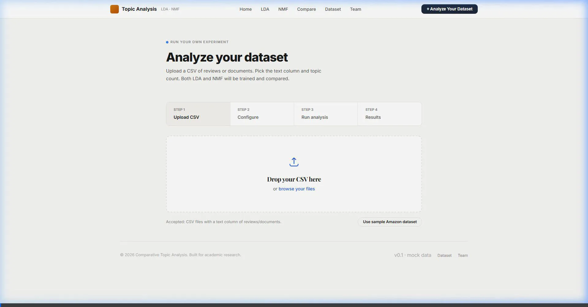
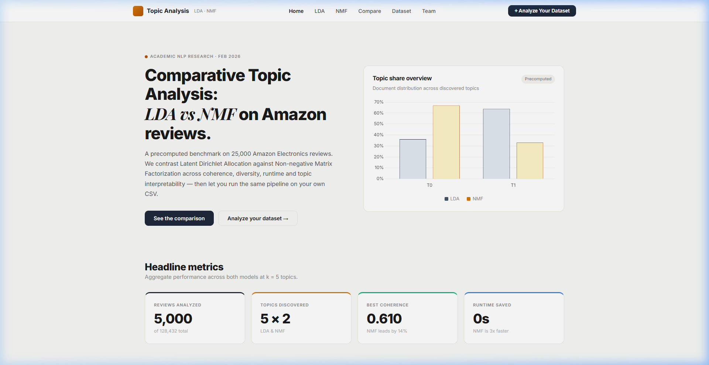
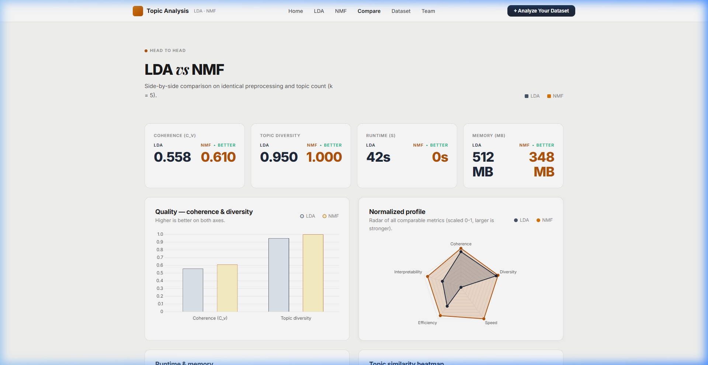

# Topic Modeling Dashboard

A Flask-based topic modeling dashboard that evaluates and compares Latent Dirichlet Allocation (LDA) vs Non-Negative Matrix Factorization (NMF) on Amazon product reviews.

## Demo Video
See the dashboard in action below! It demonstrates the topic analysis overview, comparing models, and testing custom datasets.



## Screenshots

### 1. Main Dashboard Overview
Provides a high-level view of topics extracted, model runtimes, and a comparative overview.


### 2. Head-to-Head Model Comparison
Detailed metrics and matrix breakdowns comparing LDA against NMF on coherence ($C_v$) and diversity.


## Getting Started

1. **Install dependencies:**
   Ensure you have all the required Python packages installed.

2. **Run the Application:**
   Start the local Flask server by running:
   ```bash
   python app.py
   ```
3. **Open the Dashboard:**
   Navigate to `http://127.0.0.1:5000` in your web browser.
